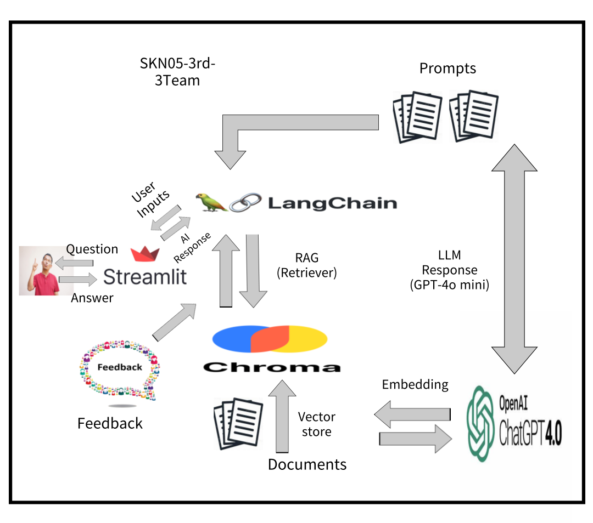

# 🏆 **팀명** 🏆

|  |  |  |  |  |
|:-------------------------------------:|:-------------------------------------:|:-------------------------------------:|:-------------------------------------:|:-------------------------------------:|
| 🐾 **안태영**                         | 🔧 **황호준**                         | 🎯 **허상호**                         | 🧠 **박초연**                         | 📄 **장정호**                         |
| **RAG Prompt Engineering** | **RAG streamlit**                   | **Preprocessing RAG**          | **Preprocessing streamlit**                   | **Preprocessing README**               |
 
 

# 🚗 운전자 보험 약관 질의응답 챗봇
## 📌 프로젝트 소개
운전자 보험 약관을 보다 쉽게 이해하고 활용할 수 있도록 설계된 질의응답 시스템입니다. 이 프로젝트는 내외부 문서를 효율적으로 처리하고, 사용자가 원하는 정보를 신속하게 제공하는 데 초점을 맞추고 있습니다.
RAG(Retrieval-Augmented Generation) 방식을 활용하여, LangChain과 Chroma 데이터베이스를 기반으로 전문 문서의 신뢰도 높은 답변을 생성합니다.

## 📌 프로젝트 동기
복잡한 보험 약관의 정보를 일반 사용자나 상담원이 쉽게 조회할 수 있도록 돕는 것이 목표입니다. 
기존 LLM 모델이 제공하는 일반적인 답변을 보완하기 위해 RAG 기술을 도입하여 실질적이고 구체적인 답변을 생성합니다.

## 📌 기능
- 문서 인덱싱:
운전자 보험 약관 데이터를 'jhgan/ko-sroberta-multitask'모델이용하여 벡터화한 문장을 저장.
- RAG 기반 검색:
Chroma DB에서 사용자의 질문과 유사한 문서를 검색.
- 질의응답 생성:
GPT-4o-mini 모델을 활용하여 검색된 문서를 기반으로 답변 생성.
- 정확한 정보 제공:
할루시네이션(잘못된 정보 생성)을 최소화하고 신뢰도 높은 답변 제공.

## 🔨 기술 스택

## 📌 System Architecture

## 📌 예시
질문: KB스마트운전자보험 약관에서 음주운전 사고 시 보장 여부는 어떻게 되나요?

일반 LLM의 답변: 음주운전 사고와 관련된 보장 여부는 약관을 참고하시길 바랍니다.
RAG 기반 답변: KB스마트운전자보험 약관에 따르면 음주운전으로 인한 사고는 보장에서 제외됩니다.
질문: 특정 사고 유형의 보장 한도는 얼마인가요?

RAG 기반 답변: 약관에 따르면, 해당 사고 유형의 보장 한도는 1억 원으로 명시되어 있습니다.
