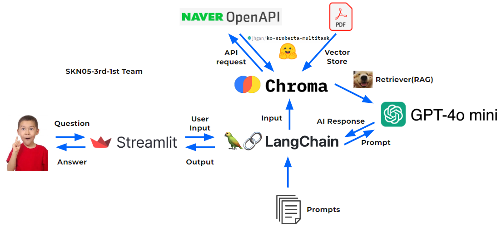
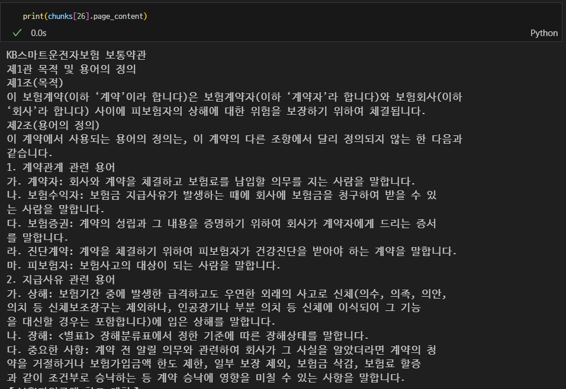
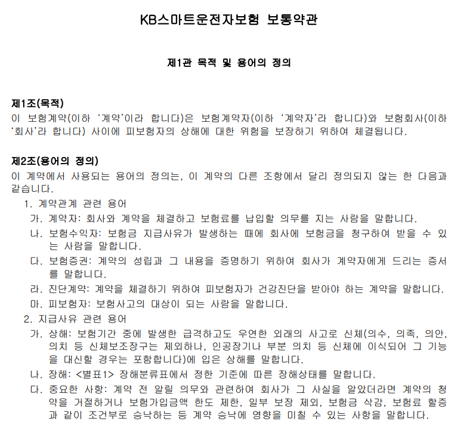
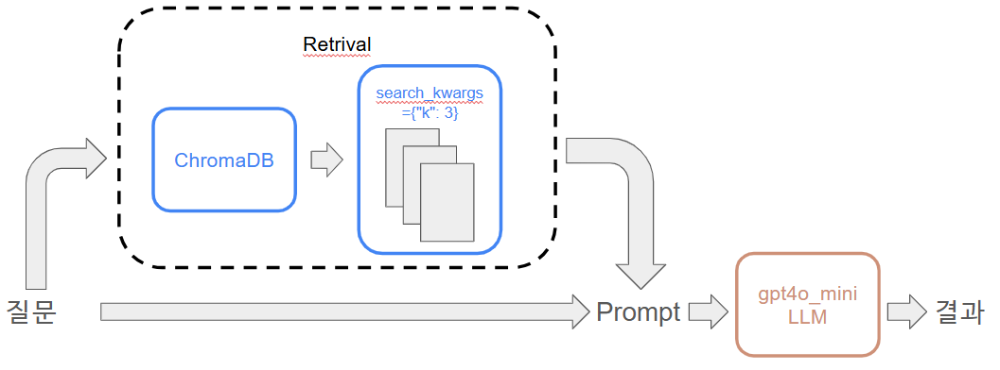
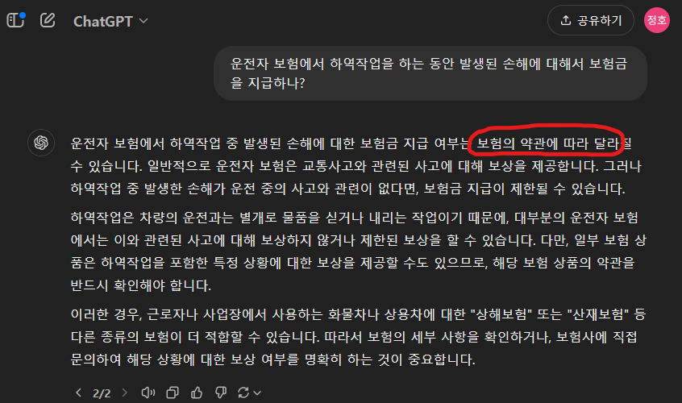
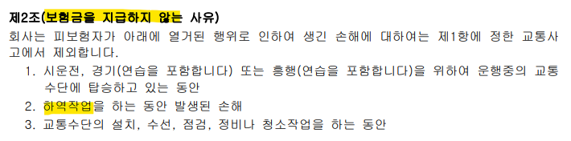
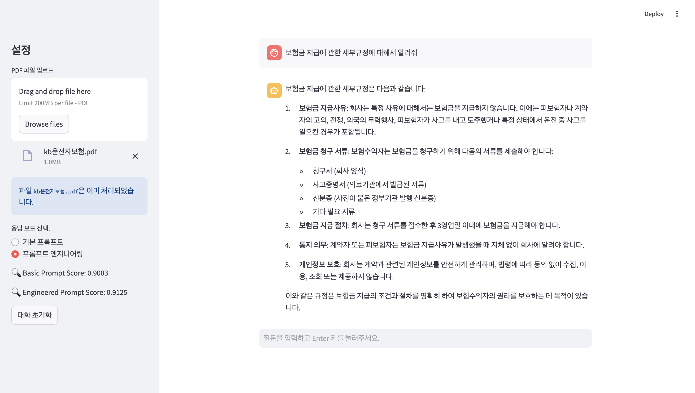

# 🏆 **팀명: 상호들** 🏆

|  |  |  |  |  |
|:-------------------------------------:|:-------------------------------------:|:-------------------------------------:|:-------------------------------------:|:-------------------------------------:|
|  **안태영**                         |  **황호준**                         |  **허상호**                         |  **박초연**                         |  **장정호**                         |
| **Langchain & RAG<br>Prompt Engineering** | **Langchain & RAG<br>streamlit**                   | **Preprocessing<br>Langchain & RAG**          | **Preprocessing<br>streamlit**                   | **Preprocessing<br>README**               |
<br>

# 🚗 운전자 보험 약관 질의응답 챗봇
## 📌 프로젝트 소개
운전자 보험 약관을 보다 쉽게 이해하고 활용할 수 있도록 설계된 질의응답 시스템입니다. 이 프로젝트는 내외부 문서를 효율적으로 처리하고, 사용자가 원하는 정보를 신속하게 제공하는 데 초점을 맞추고 있습니다.
RAG(Retrieval-Augmented Generation) 방식을 활용하여, LangChain과 Chroma 데이터베이스를 기반으로 전문 문서의 신뢰도 높은 답변을 생성합니다.

## 📌 프로젝트 동기
복잡한 보험 약관의 정보를 일반 사용자나 상담원이 쉽게 조회할 수 있도록 돕는 것이 목표입니다.<br>
기존 LLM 모델이 제공하는 일반적인 답변을 보완하기 위해 RAG 기술을 도입하여 실질적이고 구체적인 답변을 생성합니다.

## 📌 기능
- 문서 인덱싱:
운전자 보험 약관 데이터를 'jhgan/ko-sroberta-multitask'모델이용하여 벡터화한 문장을 저장.
- RAG 기반 검색:
Chroma DB에서 사용자의 질문과 유사한 문서를 검색.
- 질의응답 생성:
GPT-4o-mini 모델을 활용하여 검색된 문서를 기반으로 답변 생성.
- 정확한 정보 제공:
할루시네이션(잘못된 정보 생성)을 최소화하고 신뢰도 높은 답변 제공.

## 🔨 기술 스택
<div>


</div>

## 📌 System Architecture


## 📌 코드리뷰
데이터 로드 및 전처리(PDF 처리 및 벡터 스토어 생성)
---
```python
def load_and_split_pdf(path_ins, chunk_size=1000, chunk_overlap=200):
  ---(생략)
  return chunks

path_ins = r"C:\Users\USER\Desktop\pjt3\kb_driver_insurance.pdf"
chunks = load_and_split_pdf(path_ins)
```
|  |  |
|:-------------------------------------:|:-------------------------------------:|

PDF파일을 로드하고 텍스트를 줄, 공백으로 구분하여 청크로 나눈다.
 
```python
def process_pdf_to_vectorstore(vectorstore_name, chunks, embeddings):
    ---(생략)
    return vector_store

embeddings = HuggingFaceEmbeddings(model_name="jhgan/ko-sroberta-multitask")
vector_store = process_pdf_to_vectorstore(vectorstore_name, chunks, embeddings)
```
사전 학습된 "jhgan/ko-sroberta-multitask"모델을 사용하여 한국어 문장 임베딩을 수행한다.<br>
빠르고 효율적인 검색을 위해 ChromaDB를 이용한 벡터스토어를 생성한다.

RAG(Retrieval Augmented Generation) Chain 생성
---
```python
# 벡터 스토어 불러오기
def load_vectorstore(vectorstore_name):
    return Chroma(persist_directory=f"./data/vector_stores/{vectorstore_name}")

# 리트리버 생성
def create_retriever(vector_store):
    # MMR: 내용의 중복을 줄이고 다양성을 제공, Similarity: 내용의 유사도를 기준으로 내용을 검색
    return vector_store.as_retriever(search_type="similarity", search_kwargs={"k": 3})

# 대화형 리트리버 체인 생성
def create_conversational_chain(llm, retriever):
    # ConversationalRetrievalChain 생성
    return ConversationalRetrievalChain.from_llm(llm, retriever)
```


사용자 질문 처리 함수(프롬프트 엔지니어링 등)
---
```python
def generate_intelligent_prompt(user_input, retrieved_texts, mode="basic"):
    """
    문서 내용과 질문을 기반으로 프롬프트를 생성합니다.
    """
    if mode == "basic":
        return f"질문: {user_input}\n운전자 보험 관련 답변을 제공하세요."

    elif mode == "engineered":
        if not retrieved_texts:
            return (
                f"문서에 관련된 정보가 없습니다. 질문에 대한 답변은 "
                f"'관련 문서가 없습니다'라고 제공해야 합니다."
            )
        context = "\n".join(retrieved_texts[:3])  # 상위 3개의 문서 텍스트
        return (
            f"아래는 운전자 보험과 관련된 문서입니다. 문서 내용을 반드시 기반으로 "
            f"답변을 생성하세요. 문서에 없는 내용에 대해 유추하지 마세요.\n\n"
            f"문서 내용:\n{context}\n\n"
            f"질문: {user_input}\n"
            f"답변:"
        )
    else:
        raise ValueError("Invalid mode. Choose 'basic' or 'engineered'.")
```

## 📌 할루시네이션 테스트
|  |  |
|:-------------------------------------:|:-------------------------------------:|
| GPT-4o mini  | RAG GPT-4o mini |

<br>
RAG GPT모델의 경우 본문의 내용에서 답변을 추출했음을 확인할 수 있다.

## 📌 구현화면

